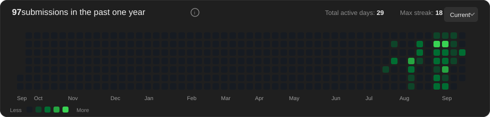

# 🧑‍💻 Satish's LeetCode Journey

  

  <b>Daily LeetCode practice, automatically tracked through GitHub.</b>
   
  Accepted solutions synced by LeetSync are reflected in this dashboard.

---

## ⚡ Quick Overview

| 🧩 Solved | 🟢 Easy | 🟡 Medium | 🔴 Hard | 🔥 Streak | 🏆 Best Streak |
|---:|---:|---:|---:|---:|---:|
| **67** | **57** | **9** | **1** | **18 days** | **18 days** |

---

## 📊 LeetCode Statistics

| Metric | Value |
|---|---:|
| 🧩 **Problems Solved** | **67** |
| 🟢 Easy | 57 / 963 |
| 🟡 Medium | 9 / 2,111 |
| 🔴 Hard | 1 / 973 |
| 🎯 Acceptance Rate | **77.1%** |
| 🔥 Current Streak | **18 days** |
| 🏆 Longest Streak | **18 days** |
| 📅 Active Days | **28** |
| 📁 Problems in Repository | **6** |

### Difficulty Progress

| Difficulty | Progress | Completion |
|---|---|---:|
| 🟢 Easy | `█░░░░░░░░░░░░░░░░░░░░░░░` | 5.9% |
| 🟡 Medium | `░░░░░░░░░░░░░░░░░░░░░░░░` | 0.4% |
| 🔴 Hard | `░░░░░░░░░░░░░░░░░░░░░░░░` | 0.1% |

## 🏁 Contest Profile

| Rating | Global Rank | Top Percentage | Contests |
|---:|---:|---:|---:|
| **1,413** | **684,876** | **78.06%** | **1** |

## 🕐 Recently Added

| Problem | Difficulty | Date |
|---|---|---|
| [154. Find Minimum in Rotated Sorted Array II](./154-find-minimum-in-rotated-sorted-array-ii) | 🔴 Hard | 2026-09-09 |
| [136. Single Number](./136-single-number) | 🟢 Easy | 2026-09-08 |
| [4245. Count Commas in Range](./4245-count-commas-in-range) | 🟢 Easy | 2026-09-08 |
| [1406. Subtract the Product and Sum of Digits of an Integer](./1406-subtract-the-product-and-sum-of-digits-of-an-integer) | 🟢 Easy | 2026-09-07 |
| [75. Sort Colors](./75-sort-colors) | 🟡 Medium | 2026-09-06 |
| [4285. Smallest Stable Index II](./4285-smallest-stable-index-ii) | 🟡 Medium | 2026-09-06 |

## 🧩 Problems Solved

### 🟢 Easy (3)

| # | Problem | Topics | Solution | Date |
|---:|---|---|---|---|
| 136 | **Single Number** | Array, Bit Manipulation | [Open](./136-single-number) | 2026-09-08 |
| 1406 | **Subtract the Product and Sum of Digits of an Integer** | Math | [Open](./1406-subtract-the-product-and-sum-of-digits-of-an-integer) | 2026-09-07 |
| 4245 | **Count Commas in Range** | Math | [Open](./4245-count-commas-in-range) | 2026-09-08 |

### 🟡 Medium (2)

| # | Problem | Topics | Solution | Date |
|---:|---|---|---|---|
| 75 | **Sort Colors** | Array, Two Pointers, Sorting, Quicksort | [Open](./75-sort-colors) | 2026-09-06 |
| 4285 | **Smallest Stable Index II** | Array, Prefix Sum | [Open](./4285-smallest-stable-index-ii) | 2026-09-06 |

### 🔴 Hard (1)

| # | Problem | Topics | Solution | Date |
|---:|---|---|---|---|
| 154 | **Find Minimum in Rotated Sorted Array II** | Array, Binary Search | [Open](./154-find-minimum-in-rotated-sorted-array-ii) | 2026-09-09 |

## 🧠 Top Topics

| Topic | Problems |
|---|---:|
| Array | 4 |
| Math | 2 |
| Two Pointers | 1 |
| Sorting | 1 |
| Quicksort | 1 |
| Bubble Sort | 1 |
| Bit Manipulation | 1 |
| Binary Search | 1 |
| Prefix Sum | 1 |

## 💻 Languages Used

| Language | Solutions |
|---|---:|
| Java | 5 |
| Python | 1 |

## 📅 Last 30 Days

| Date | Submissions |
|---|---:|
| 2026-08-11 | 3 |
| 2026-08-12 | 2 |
| 2026-08-13 | 0 |
| 2026-08-14 | 0 |
| 2026-08-15 | 0 |
| 2026-08-16 | 0 |
| 2026-08-17 | 0 |
| 2026-08-18 | 0 |
| 2026-08-19 | 0 |
| 2026-08-20 | 0 |
| 2026-08-21 | 0 |
| 2026-08-22 | 0 |
| 2026-08-23 | 1 |
| 2026-08-24 | 10 |
| 2026-08-25 | 5 |
| 2026-08-26 | 4 |
| 2026-08-27 | 1 |
| 2026-08-28 | 5 |
| 2026-08-29 | 5 |
| 2026-08-30 | 2 |
| 2026-08-31 | 11 |
| 2026-09-01 | 3 |
| 2026-09-02 | 3 |
| 2026-09-03 | 6 |
| 2026-09-04 | 2 |
| 2026-09-05 | 3 |
| 2026-09-06 | 1 |
| 2026-09-07 | 1 |
| 2026-09-08 | 2 |
| 2026-09-09 | 1 |

---

## 🔗 Profiles

- 🟧 [LeetCode](https://leetcode.com/u/kl2400030372/)
- 🐙 [GitHub](https://github.com/kl2400030372)

---

  
    🤖 Automatically updated by GitHub Actions
     
    Last update: 09 Sep 2026, 17:19
  

