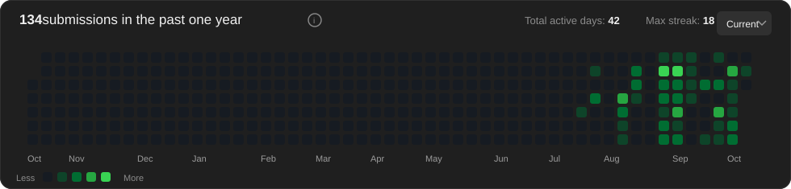

# 🧑‍💻 Satish's LeetCode Journey

  

  <b>Daily LeetCode practice, automatically tracked through GitHub.</b>
   
  Accepted solutions synced by LeetSync are reflected in this dashboard.

---

## ⚡ Quick Overview

| 🧩 Solved | 🟢 Easy | 🟡 Medium | 🔴 Hard | 🔥 Streak | 🏆 Best Streak |
|---:|---:|---:|---:|---:|---:|
| **95** | **78** | **16** | **1** | **6 days** | **18 days** |

---

## 📊 LeetCode Statistics

| Metric | Value |
|---|---:|
| 🧩 **Problems Solved** | **95** |
| 🟢 Easy | 78 / 969 |
| 🟡 Medium | 16 / 2,124 |
| 🔴 Hard | 1 / 980 |
| 🎯 Acceptance Rate | **75.7%** |
| 🔥 Current Streak | **6 days** |
| 🏆 Longest Streak | **18 days** |
| 📅 Active Days | **41** |
| 📁 Problems in Repository | **33** |

### Difficulty Progress

| Difficulty | Progress | Completion |
|---|---|---:|
| 🟢 Easy | `██░░░░░░░░░░░░░░░░░░░░░░` | 8.0% |
| 🟡 Medium | `░░░░░░░░░░░░░░░░░░░░░░░░` | 0.8% |
| 🔴 Hard | `░░░░░░░░░░░░░░░░░░░░░░░░` | 0.1% |

## 🏁 Contest Profile

| Rating | Global Rank | Top Percentage | Contests |
|---:|---:|---:|---:|
| **1,413** | **687,720** | **77.95%** | **1** |

## 🕐 Recently Added

| Problem | Difficulty | Date |
|---|---|---|
| [50. Pow(x, n)](./50-powx-n) | 🟡 Medium | 2026-10-03 |
| [541. Reverse String II](./541-reverse-string-ii) | 🟢 Easy | 2026-10-03 |
| [861. Flipping an Image](./861-flipping-an-image) | 🟢 Easy | 2026-10-03 |
| [20. Valid Parentheses](./20-valid-parentheses) | 🟢 Easy | 2026-10-02 |
| [33. Search in Rotated Sorted Array](./33-search-in-rotated-sorted-array) | 🟡 Medium | 2026-10-02 |
| [414. Third Maximum Number](./414-third-maximum-number) | 🟢 Easy | 2026-10-02 |
| [389. Find the Difference](./389-find-the-difference) | 🟢 Easy | 2026-09-30 |
| [53. Maximum Subarray](./53-maximum-subarray) | 🟡 Medium | 2026-09-29 |
| [66. Plus One](./66-plus-one) | 🟢 Easy | 2026-09-28 |
| [387. First Unique Character in a String](./387-first-unique-character-in-a-string) | 🟢 Easy | 2026-09-28 |

## 🧩 Problems Solved

### 🟢 Easy (23)

| # | Problem | Topics | Solution | Date |
|---:|---|---|---|---|
| 20 | **Valid Parentheses** | String, Stack, Bracket Sequences | [Open](./20-valid-parentheses) | 2026-10-02 |
| 66 | **Plus One** | Array, Math | [Open](./66-plus-one) | 2026-09-28 |
| 125 | **Valid Palindrome** | Two Pointers, String | [Open](./125-valid-palindrome) | 2026-09-22 |
| 136 | **Single Number** | Array, Bit Manipulation | [Open](./136-single-number) | 2026-09-08 |
| 205 | **Isomorphic Strings** | Hash Table, String | [Open](./205-isomorphic-strings) | 2026-09-24 |
| 219 | **Contains Duplicate II** | Array, Hash Table, Sliding Window | [Open](./219-contains-duplicate-ii) | 2026-09-15 |
| 350 | **Intersection of Two Arrays II** | Array, Hash Table, Two Pointers, Binary Search | [Open](./350-intersection-of-two-arrays-ii) | 2026-09-19 |
| 387 | **First Unique Character in a String** | Hash Table, String, Queue, Counting | [Open](./387-first-unique-character-in-a-string) | 2026-09-28 |
| 389 | **Find the Difference** | Hash Table, String, Bit Manipulation, Sorting | [Open](./389-find-the-difference) | 2026-09-30 |
| 414 | **Third Maximum Number** | Array, Sorting | [Open](./414-third-maximum-number) | 2026-10-02 |
| 541 | **Reverse String II** | Two Pointers, String | [Open](./541-reverse-string-ii) | 2026-10-03 |
| 861 | **Flipping an Image** | Array, Two Pointers, Bit Manipulation, Matrix | [Open](./861-flipping-an-image) | 2026-10-03 |
| 1406 | **Subtract the Product and Sum of Digits of an Integer** | Math | [Open](./1406-subtract-the-product-and-sum-of-digits-of-an-integer) | 2026-09-07 |
| 1444 | **Number of Steps to Reduce a Number to Zero** | Math, Bit Manipulation | [Open](./1444-number-of-steps-to-reduce-a-number-to-zero) | 2026-09-27 |
| 1833 | **Find the Highest Altitude** | Array, Prefix Sum | [Open](./1833-find-the-highest-altitude) | 2026-09-28 |
| 1950 | **Sign of the Product of an Array** | Array, Math | [Open](./1950-sign-of-the-product-of-an-array) | 2026-09-28 |
| 2427 | **First Letter to Appear Twice** | Hash Table, String, Bit Manipulation, Counting | [Open](./2427-first-letter-to-appear-twice) | 2026-09-27 |
| 2502 | **Sort the People** | Array, Hash Table, String, Sorting | [Open](./2502-sort-the-people) | 2026-09-19 |
| 3321 | **Type of Triangle** | Array, Math, Sorting, Polygons | [Open](./3321-type-of-triangle) | 2026-09-28 |
| 3811 | **Reverse Degree of a String** | String, Simulation | [Open](./3811-reverse-degree-of-a-string) | 2026-09-20 |
| 3869 | **Smallest Index With Digit Sum Equal to Index** | Array, Math | [Open](./3869-smallest-index-with-digit-sum-equal-to-index) | 2026-09-24 |
| 4245 | **Count Commas in Range** | Math | [Open](./4245-count-commas-in-range) | 2026-09-08 |
| 4410 | **Count Integers Appearing in a Single Block** | Array, Hash Table, Counting | [Open](./4410-count-integers-appearing-in-a-single-block) | 2026-09-24 |

### 🟡 Medium (9)

| # | Problem | Topics | Solution | Date |
|---:|---|---|---|---|
| 33 | **Search in Rotated Sorted Array** | Array, Binary Search | [Open](./33-search-in-rotated-sorted-array) | 2026-10-02 |
| 50 | **Pow(x, n)** | Math, Recursion | [Open](./50-powx-n) | 2026-10-03 |
| 53 | **Maximum Subarray** | Array, Divide and Conquer, Dynamic Programming | [Open](./53-maximum-subarray) | 2026-09-29 |
| 75 | **Sort Colors** | Array, Two Pointers, Sorting, Quicksort | [Open](./75-sort-colors) | 2026-09-06 |
| 137 | **Single Number II** | Array, Bit Manipulation | [Open](./137-single-number-ii) | 2026-09-24 |
| 167 | **Two Sum II - Input Array Is Sorted** | Array, Two Pointers, Binary Search | [Open](./167-two-sum-ii-input-array-is-sorted) | 2026-09-22 |
| 260 | **Single Number III** | Array, Bit Manipulation | [Open](./260-single-number-iii) | 2026-09-24 |
| 882 | **Peak Index in a Mountain Array** | Array, Binary Search, Ternary Search | [Open](./882-peak-index-in-a-mountain-array) | 2026-09-25 |
| 4285 | **Smallest Stable Index II** | Array, Prefix Sum | [Open](./4285-smallest-stable-index-ii) | 2026-09-06 |

### 🔴 Hard (1)

| # | Problem | Topics | Solution | Date |
|---:|---|---|---|---|
| 154 | **Find Minimum in Rotated Sorted Array II** | Array, Binary Search | [Open](./154-find-minimum-in-rotated-sorted-array-ii) | 2026-09-09 |

## 🧠 Top Topics

| Topic | Problems |
|---|---:|
| Array | 21 |
| String | 9 |
| Math | 8 |
| Hash Table | 8 |
| Bit Manipulation | 7 |
| Two Pointers | 6 |
| Sorting | 6 |
| Binary Search | 5 |
| Counting | 3 |
| Simulation | 2 |
| Prefix Sum | 2 |
| Stack | 1 |
| Bracket Sequences | 1 |
| Recursion | 1 |
| Divide and Conquer | 1 |

## 💻 Languages Used

| Language | Solutions |
|---|---:|
| Java | 31 |
| Python | 1 |

## 📅 Last 30 Days

| Date | Submissions |
|---|---:|
| 2026-09-05 | 3 |
| 2026-09-06 | 1 |
| 2026-09-07 | 1 |
| 2026-09-08 | 2 |
| 2026-09-09 | 1 |
| 2026-09-10 | 0 |
| 2026-09-11 | 0 |
| 2026-09-12 | 0 |
| 2026-09-13 | 0 |
| 2026-09-14 | 0 |
| 2026-09-15 | 3 |
| 2026-09-16 | 0 |
| 2026-09-17 | 0 |
| 2026-09-18 | 0 |
| 2026-09-19 | 2 |
| 2026-09-20 | 1 |
| 2026-09-21 | 0 |
| 2026-09-22 | 4 |
| 2026-09-23 | 0 |
| 2026-09-24 | 6 |
| 2026-09-25 | 1 |
| 2026-09-26 | 2 |
| 2026-09-27 | 0 |
| 2026-09-28 | 8 |
| 2026-09-29 | 2 |
| 2026-09-30 | 1 |
| 2026-10-01 | 1 |
| 2026-10-02 | 4 |
| 2026-10-03 | 4 |
| 2026-10-04 | 0 |

---

## 🔗 Profiles

- 🟧 [LeetCode](https://leetcode.com/u/kl2400030372/)
- 🐙 [GitHub](https://github.com/kl2400030372)

---

  
    🤖 Automatically updated by GitHub Actions
     
    Last update: 04 Oct 2026, 21:45
  

